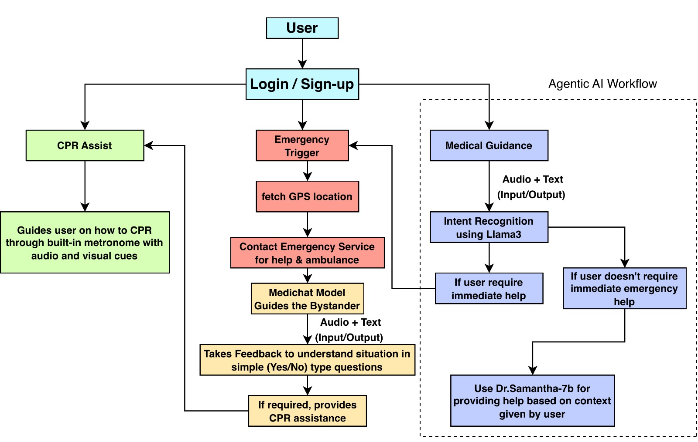
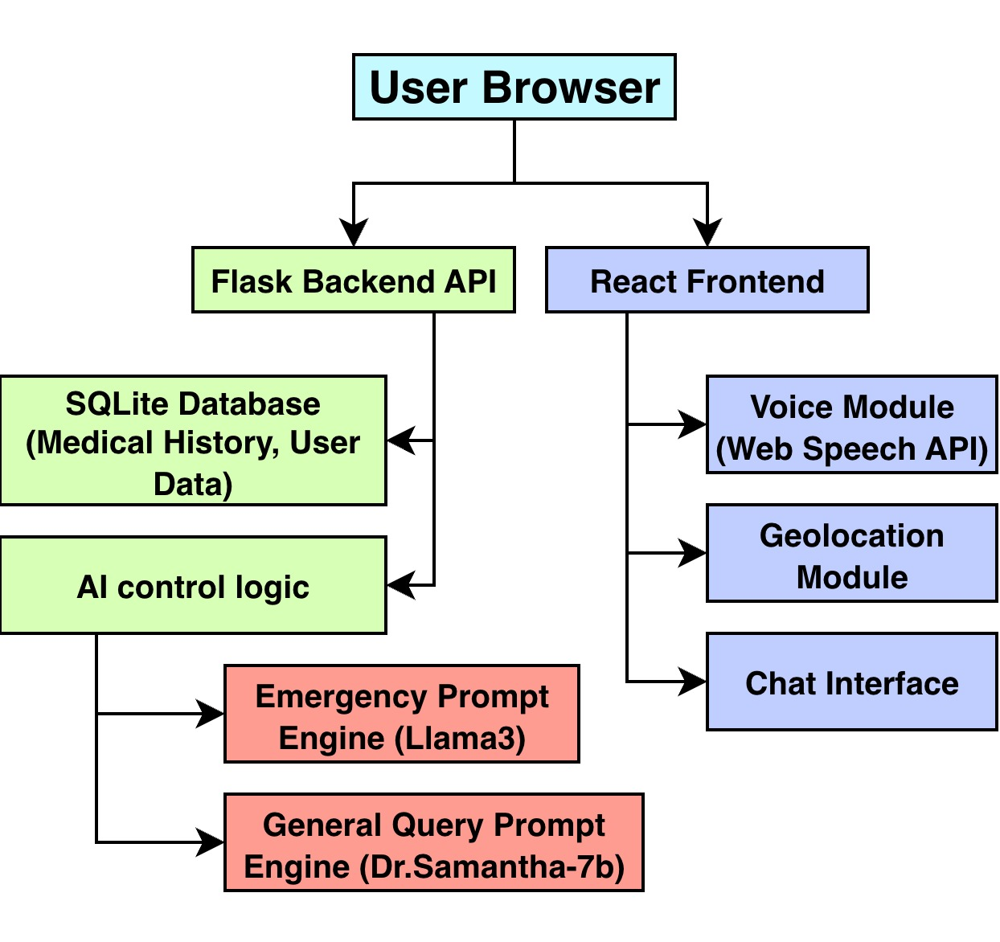

# SanjeevniAI: Smart Emergency Response Assistant 🚑

> **Team Mahagathbandhan (IIT Delhi)**
> *Brahmasees Singh Makkar | Neelesh Mishra | Shreyans Jain*
>
> *Submitted for Hackxios Hackathon - December 30, 2025*

**SanjeevniAI** is a comprehensive, minimalist emergency response web application designed to act as a **digital first-responder**. It bridges the gap between the onset of a medical emergency and the arrival of professional help by guiding untrained bystanders through critical life-saving actions.

🚀 **Live Demo:** [https://mahagathbandhan-hackxios.vercel.app/](https://mahagathbandhan-hackxios.vercel.app/)

---

## ❓ Problem Statement: The Golden Hour

In critical health emergencies, immediate guidance is often unavailable. A large percentage of emergencies occur where trained personnel are not present, and valuable minutes are lost before professional help arrives.

*   **The Golden Hour is Critical:** Proper care within the first hour can increase survival chances by up to **80%** (WHO).
*   **Every Minute Counts:** In cardiac arrest, each minute without CPR decreases survival odds by **7–10%** (AHA).
*   **Untrained First Responders:** The first person on the scene is often a commuter, shopkeeper, or passer-by with no formal medical training. Panic and hesitation can lead to avoidable fatalities.

**SanjeevniAI** empowers these everyday bystanders to act calmly and effectively during those crucial first few minutes.

---

## 💡 Solution Overview

SanjeevniAI is designed to be fast, intuitive, and reliable. Rather than replacing doctors, it focuses on reducing cognitive load during high-stress situations.

### Key Capabilities

#### 1. 🚨 Panic-First Interface
Most emergency apps force users to navigate menus—wasting precious seconds. SanjeevniAI presents a **large, single emergency button** that instantly:
*   Activates **Emergency Mode**.
*   Increases screen contrast for visibility.
*   Starts logging vital context (Time, GPS, Type of Incident).
*   Prepares guidance workflows.

#### 2. 🤖 Dual-Mode AI Guidance
The system intelligently switches between two interaction styles:
*   **Emergency Mode (Llama 3.1):** Short, assertive, protocol-driven instructions. It asks "Yes/No" triage questions and avoids long paragraphs to ensure immediate action (e.g., "Check breathing," "Start compressions").
*   **General Mode (Dr. Samantha):** A friendly, conversational health assistant for non-urgent advice, FAQs, and wellness queries.

#### 3. 🗣️ Hands-Free Voice Interaction
During CPR or bleeding control, users cannot type. SanjeevniAI supports:
*   **Speech-to-Text:** For hands-free reporting.
*   **Text-to-Speech:** Instructions are spoken aloud so the user can focus on the patient.
*   **Auto-Send on Silence:** Detects when the user stops speaking to send the message automatically, keeping hands free for lifesaving actions.

#### 4. 💓 Integrated CPR Metronome
CPR quality directly affects survival. The app includes a dedicated tool providing:
*   Audio/Visual guidance at **100–120 BPM** (standard CPR rate).
*   Visual pulse indicators.
*   Automatic activation when the AI detects a cardiac arrest scenario.

#### 5. 📍 Live Context & Secure Profile
*   **Emergency Sharing:** Securely captures latitude/longitude, incident time, and ongoing instructions to share with responders.
*   **Medical Profile:** encrypted storage for allergies, chronic conditions, blood type, and medications. The AI uses this to prevent contraindicated advice (e.g., avoiding specific drugs).

---

## 🏗️ Architecture & Workflow

### User Flow
1.  **Login:** User logs in and loads their secure medical profile.
2.  **Activation:** Panic button captures GPS and triggers **Emergency Mode**.
3.  **Triage:** User communicates symptoms via voice or text.
4.  **Guidance:** AI delivers concise, actionable steps (Triage -> Action -> Verify).
5.  **Intervention:** Tools like the CPR Metronome activate automatically when required.



### System Architecture


### Tech Stack
*   **Frontend:** React (Vite), Tailwind CSS, Lucide React, React-Leaflet.
*   **Backend:** Flask (Python), SQLite (SQLAlchemy), Werkzeug Security.
*   **AI Engine:** Hugging Face Inference API (Meta-Llama-3-8B-Instruct).
*   **Deployment:** Vercel (Frontend), PythonAnywhere (Backend).

---

## 🚀 Installation & Setup

Follow these instructions to run the project locally.

### Prerequisites
- Node.js (v18+)
- Python (v3.10+)

### 1. Backend Setup (Flask API)

```bash
cd backend
python -m venv venv
# Windows: venv\Scripts\activate | macOS/Linux: source venv/bin/activate
pip install -r requirements.txt
python app.py
```
*The backend runs on `http://localhost:5000`.*

### 2. Frontend Setup (React App)

```bash
cd frontend
npm install
```

> **Important:** The frontend is currently configured to point to the production backend (`https://reddragonnm.pythonanywhere.com`). To use your local backend, replace this URL with `http://localhost:5000` in the `src/` files.

```bash
npm run dev
```
*The frontend runs on `http://localhost:5173`.*

---

## 🧠 Challenges & Learnings

*   **CORS & Proxying:** Solved communication issues between the React frontend and Flask backend using proper proxy routing and header configurations.
*   **Database Security:** Addressed password hash truncation issues by expanding database column limits and implementing secure hashing.
*   **Voice State Management:** Used `useRef()` hooks to ensure consistent chat history access during asynchronous voice recognition events.
*   **Accessibility:** Implemented a theme-aware UI to improve visibility in high-stress, low-light emergency environments.

---

## 🗺️ Future Roadmap

*   🚑 **Live Ambulance Tracking:** Integration with emergency dispatch APIs.
*   📶 **Offline AI Support:** Implementing lightweight, on-device models for low-bandwidth areas.
*   📹 **Video Assistance:** Computer vision for wound detection and real-time CPR posture correction.

---

## 📄 License

Distributed under the MIT License.

---

*Built with ❤️ by Team Mahagathbandhan for a safer world.*